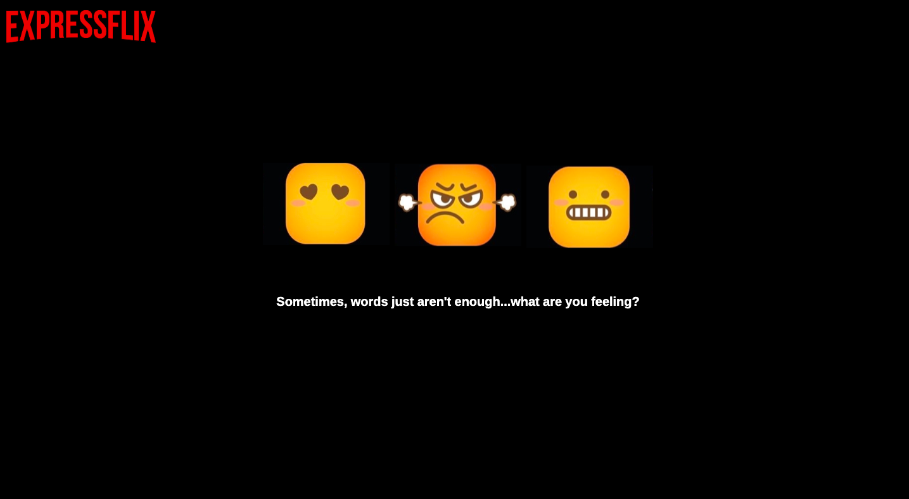
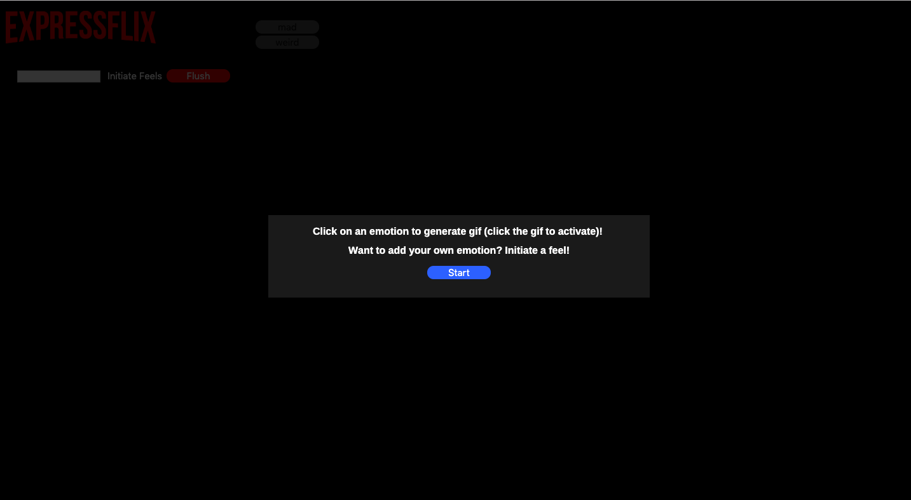
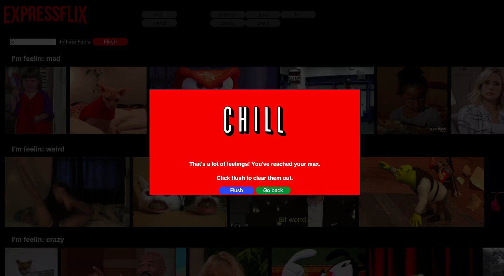

# giftastic

## Pictures of Site
Initial loading page:

Page to display directions:

Page when a user clicks on a button with an emotion (clicking on the gifs will switch them from being still images to animated gifs and vice versa):

Page when a user generates more than 6 rows of emotions:

## Description of Site
[Click here to visit site](https://minori-fh.github.io/giftastic/)

A trivia game for the purpose of:  
1. Practicing newly learned skills using AJAX to use APIs

## Technologies Used
1. HTML 
2. CSS
4. Javascript
5. jQuery
6. AJAX/ API calls

*please note that gif contents were retrieved from the giphy API

## Author(s): [Minori Hashimoto](https://github.com/minori-fh)